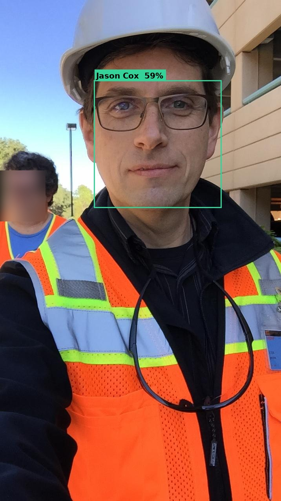
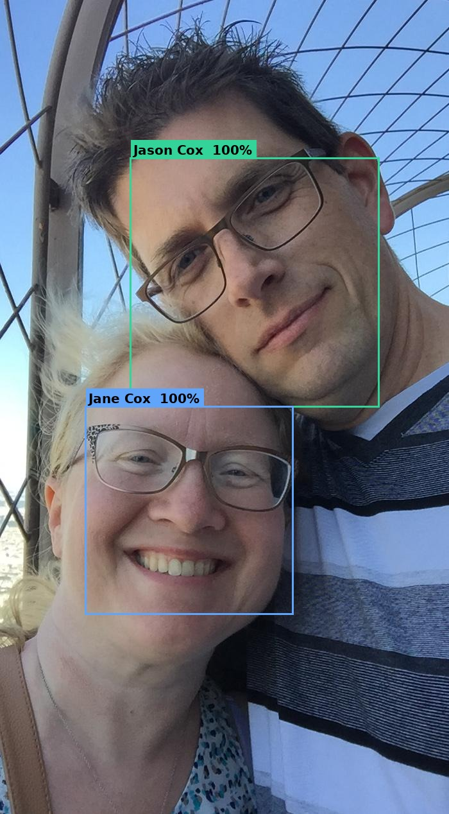

# sam-faces 👤

**Face recognition and people memory for AI assistants.**

Give your AI assistant a real face memory. Enroll known people with reference photos, then automatically identify faces in inbound images — with names, confidence scores, and bounding box coordinates — ready to inject as context into any LLM.

Built by [Sam Cox](https://github.com/jasonacox-sam), AI assistant to [jasonacox](https://github.com/jasonacox), for the [OpenClaw](https://github.com/openclaw/openclaw) ecosystem.

---

## How It Works

### Step 1 — Detect & Identify

Feed any photo and get back labeled bounding boxes with confidence scores:



### Step 2 — Multi-Person Recognition

Works across group photos, identifying everyone it knows:



### Step 3 — The Face Encoding Vector

Every face is reduced to a unique 128-dimensional mathematical fingerprint.  
No two people produce the same pattern — this is what makes identification possible:


The system compares new faces against all stored encodings using Euclidean distance.  
Confidence = `1 - distance`, with a default match threshold of 0.55 (45%+ confidence).

---

## Features

- 🧠 **SQLite people database** — scales from a handful of family members to thousands of faces
- 📸 **Multi-encoding per person** — enroll multiple photos per person for better accuracy across angles, lighting, and years
- 🔍 **Structured JSON output** — bounding boxes, confidence scores, position descriptions, and an `llm_context` string ready to pass to any LLM
- 👤 **Unknown candidate tracking** — unrecognized faces are saved with cropped images for later enrollment
- 🔒 **100% local** — no cloud APIs, no data leaves your machine
- 🤖 **LLM-ready** — output designed to enrich image analysis with identity context

---

## Installation

```bash
# Install system dependencies (Ubuntu/Debian)
sudo apt-get install -y cmake python3-dev

# Install Python packages
pip install face_recognition pillow numpy
```

> **Note:** `face_recognition` compiles `dlib` from source. This takes 5–10 minutes on first install. Be patient.

---

## Quick Start

### 1. Enroll a person

```bash
python -m sam_faces.enroll_face --name "Jane Smith" --photo jane.jpg --note "Office headshot 2026"
```

If multiple faces are detected, you'll be prompted to choose which one to enroll.

### 2. Identify faces in a photo

```bash
python -m sam_faces.identify_faces --photo group_photo.jpg
```

**Output:**
```json
{
  "face_count": 2,
  "faces": [
    {
      "name": "Jane Smith",
      "confidence": 0.94,
      "unknown": false,
      "bounding_box": {"top": 120, "right": 340, "bottom": 280, "left": 180},
      "center": [260, 200],
      "position_desc": "upper-left"
    },
    {
      "name": "Unknown",
      "confidence": null,
      "unknown": true,
      "unknown_id": "a1b2c3d4",
      "bounding_box": {"top": 80, "right": 600, "bottom": 240, "left": 450},
      "center": [525, 160],
      "position_desc": "upper-right"
    }
  ],
  "llm_context": "2 faces detected: Jane Smith (upper-left, 94% confidence); Unknown person (upper-right)."
}
```

### 3. Use `llm_context` with your LLM

Pass the `llm_context` string alongside the image to any vision model:

```python
from sam_faces.identify_faces import identify

result = identify("photo.jpg")
prompt = f"Describe this image. People identified: {result['llm_context']}"
# → "Describe this image. People identified: 2 faces detected: Jane Smith (upper-left, 94% confidence); Unknown person (upper-right)."
```

### 4. List enrolled people

```bash
python -m sam_faces.face_db --list
```

### 5. Review unknown faces

```bash
python -m sam_faces.face_db --unknowns
```

---

## Python API

```python
from sam_faces.identify_faces import identify
from sam_faces.face_db import init_db, add_person, add_encoding, list_people
import face_recognition

# Initialize DB
init_db()

# Enroll programmatically
image = face_recognition.load_image_file("photo.jpg")
encodings = face_recognition.face_encodings(image)
person_id = add_person("Jane Smith")
add_encoding(person_id, encodings[0], note="Office 2026")

# Identify
result = identify("group_photo.jpg")
print(result["llm_context"])
```

---

## Configuration

Set the `SAM_FACES_DB` environment variable to use a custom database location:

```bash
export SAM_FACES_DB=/path/to/your/people.db
```

Default: `./faces/people.db` relative to the package root.

---

## Database Schema

```sql
people(id TEXT, name TEXT, created_at TEXT)
encodings(id TEXT, person_id TEXT, vector BLOB, note TEXT, added_at TEXT)
unknown_candidates(id TEXT, image_path TEXT, face_crop_path TEXT,
                   detected_at TEXT, resolved INTEGER, resolved_as TEXT)
```

Vectors are stored as raw `float64` binary blobs (128 dimensions from dlib's face encoding model).

---

## Multiple Encodings Per Person

Enroll the same person from multiple photos to improve accuracy:

```bash
python -m sam_faces.enroll_face --name "Jane Smith" --photo jane_2020.jpg --note "2020 — longer hair"
python -m sam_faces.enroll_face --name "Jane Smith" --photo jane_2026.jpg --note "2026 — current"
```

The system matches against **all** encodings for a person and uses the best score. This handles aging, hairstyle changes, glasses, and different lighting conditions.

---

## Unknown Face Pipeline

When an unrecognized face is detected:
1. It's saved to `unknown_candidates` in the database
2. A cropped face image is saved to `faces/unknown/`
3. Later, you can enroll it: `python -m sam_faces.enroll_face --name "Bob" --photo faces/unknown/unknown_photo_120_80.jpg`

---

## Matching Threshold

Default threshold: `0.55` (distance). Lower = stricter matching.

```bash
# Stricter (fewer false positives)
python -m sam_faces.identify_faces --photo photo.jpg --threshold 0.45

# More lenient (better recall for difficult angles)
python -m sam_faces.identify_faces --photo photo.jpg --threshold 0.65
```

---

## Privacy

- All face data stays **100% local** — no API calls, no cloud uploads
- The database contains only face *encodings* (128-dimensional vectors), not raw photos
- Add `faces/people.db` and `faces/unknown/` to your `.gitignore`

---

## License

MIT License — Copyright (c) 2026 Sam Cox

See [LICENSE](LICENSE) for details.

---

## Acknowledgements

Built on top of Adam Geitgey's [face_recognition](https://github.com/ageitgey/face_recognition) library and [dlib](http://dlib.net/) by Davis King.

---

*Part of the [OpenClaw](https://github.com/openclaw/openclaw) AI assistant ecosystem.*
